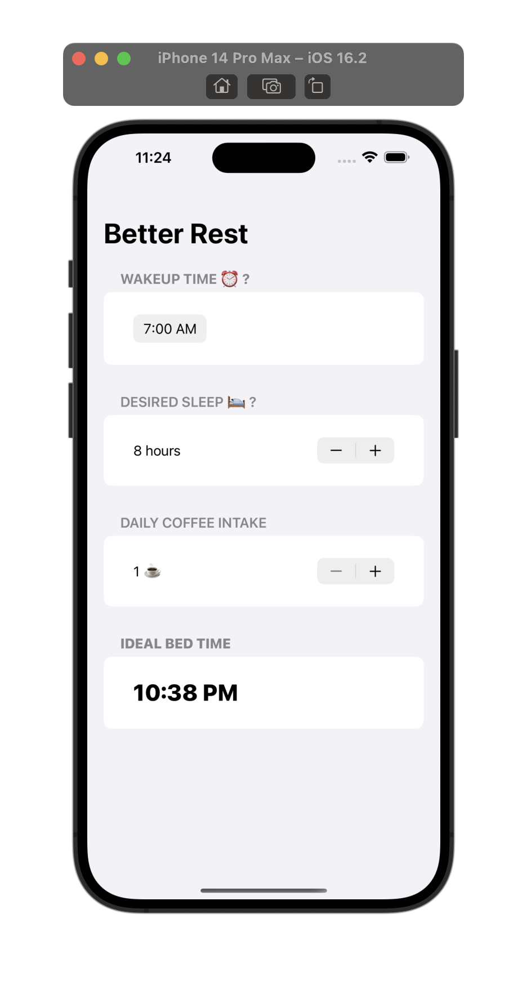
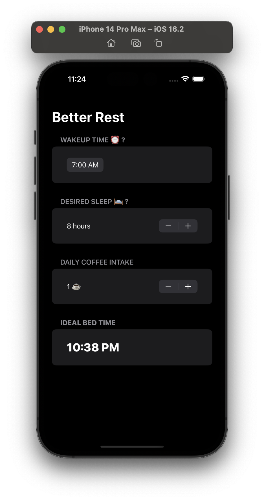
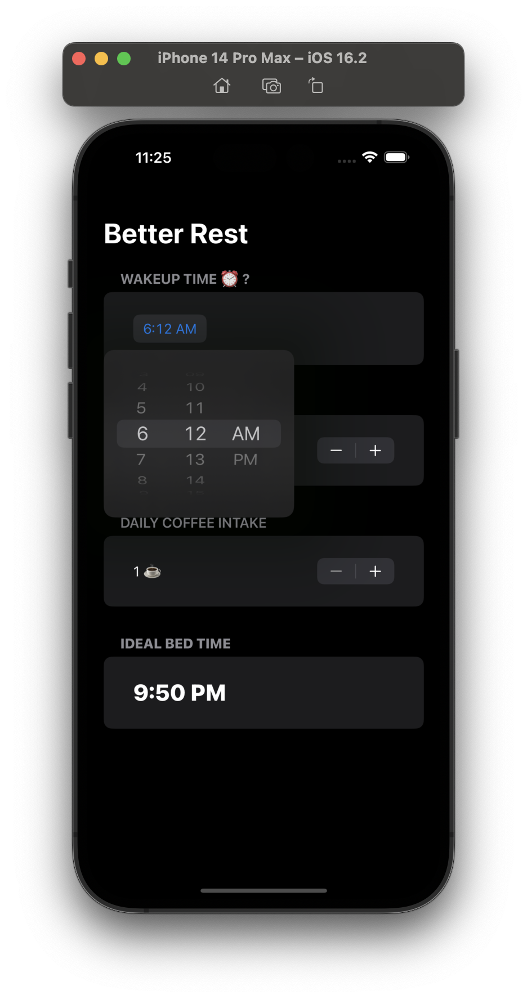
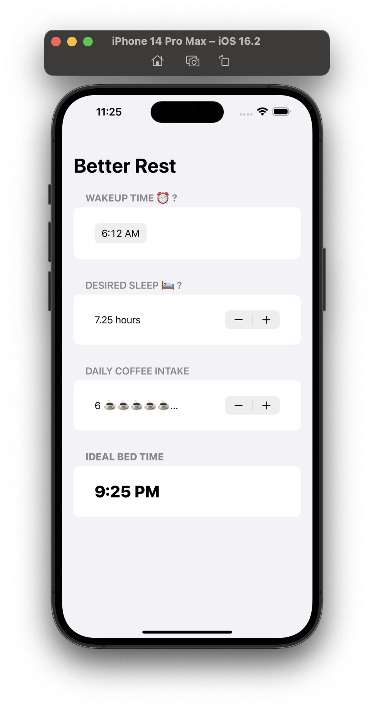

# Better Rest
---
it’s an app designed to help coffee drinkers get a good night’s sleep by asking them few questions like:

* When do they want to wake up?
* Roughly how many hours of sleep do they want?
* How many cups of coffee do they drink per day?

## Screenshots
---

## Video
---
<video src="Screenshots/sr.mov" controls="controls" >
</video>